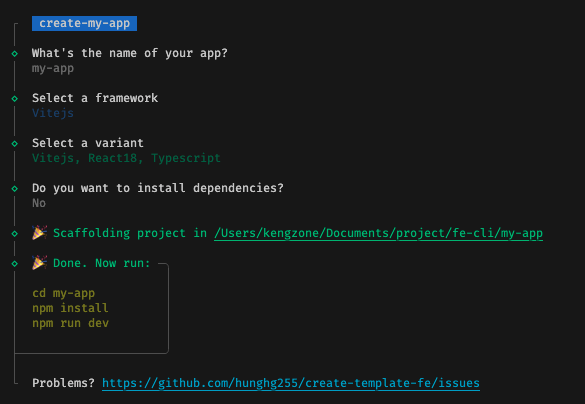

<p align="center">
<a href="https://www.npmjs.com/package/create-template-fe" target="_blank" rel="noopener noreferrer">
</a>
</p>

<p align="center">
  A script to create a template for front-end projects.
</p>

<p align="center">
  <a href="https://www.npmjs.com/package/create-template-fe" target="_blank" rel="noopener noreferrer"></a>
  <a href="https://www.npmjs.com/package/create-template-fe" target="_blank" rel="noopener noreferrer"></a>
  <a href="https://bundlephobia.com/result?p=create-template-fe" target="_blank" rel="noopener noreferrer"></a>
  <a href="https://github.com/hunghg255/create-template-fe/graphs/contributors" target="_blank" rel="noopener noreferrer"></a>
  <a href="https://github.com/hunghg255/create-template-fe/blob/main/LICENSE" target="_blank" rel="noopener noreferrer"></a>
</p>

## Get started

```bash
# npx
npx create-template-fe@latest

# pnpx
pnpx create-template-fe@latest

# bunx
bunx create-template-fe@latest
```

## Templates

```md
- Vanillajs
  |- HTML, CSS, JS
  |- HTML, CSS, JS, Webpack

- Vitejs
  |- Vitejs, React18, Typescript
  |- Vitejs, React18, Typescript, SWC
  |- Vitejs, Antd, Recoil, i18n, Typescript

- Rsbuild
  |- Rsbuild, Antd, Recoil, i18n, Typescript

- Nextjs
  |- Next12, Antd, Recoil, i18n, Typescript
  |- Next13, Antd, Jotai, i18n, Typescript (Page Router)
  |- Next13, Tailwindcss, Jotai, i18n, Typescript (Page Router)
  |- Next13 (App Router)

- Svelte
  |- Sveltekit, Tailwindcss, Typescript

- Template create a package
  |- Rollup, React, Typescript
  |- Microbundle, React, Typescript
  |- Microbundle, Typescript
  |- Tsup, typescript
  |- unbuild, typescript
  |- Rollup, Svelte, Typescript
  |- Tsup, Svelte, Typescript
  |- Bunchee, typescript
  |- Bunchee, React, typescript
  |- Rslib, typescript

- Template create a blog
  |- Docusaurus, Typescript, Embeded Expo (React native), Stackblitz

- Template create a github action
  |- Actions Core, Typescript
```


## Demo



